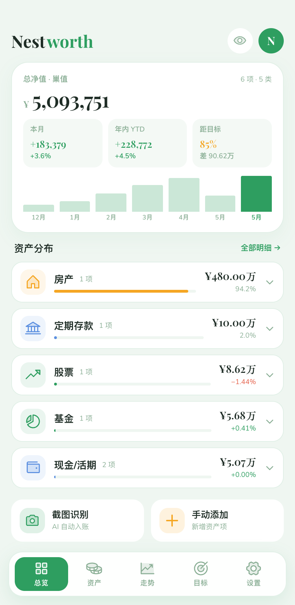
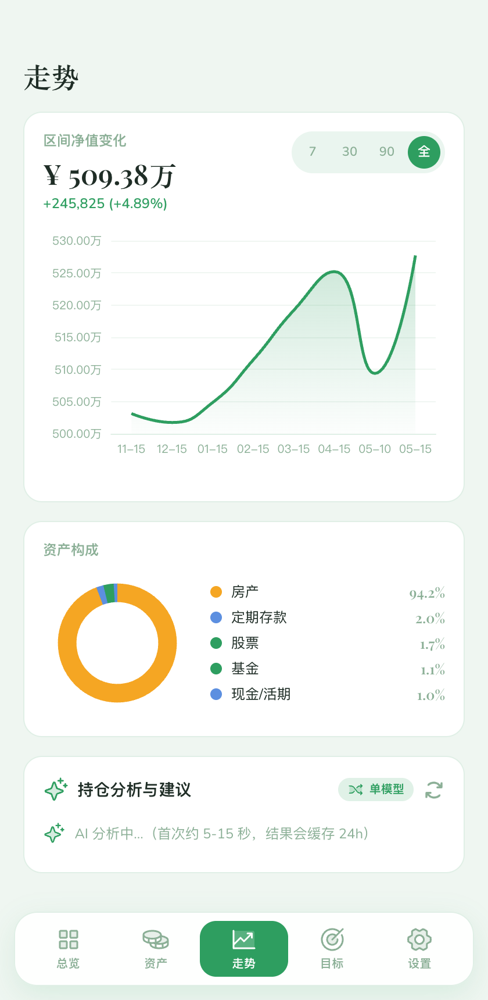
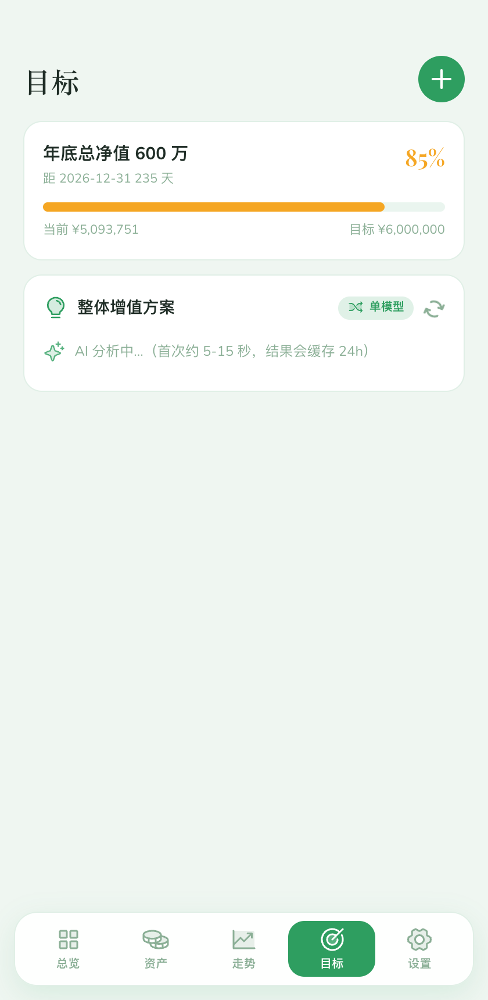
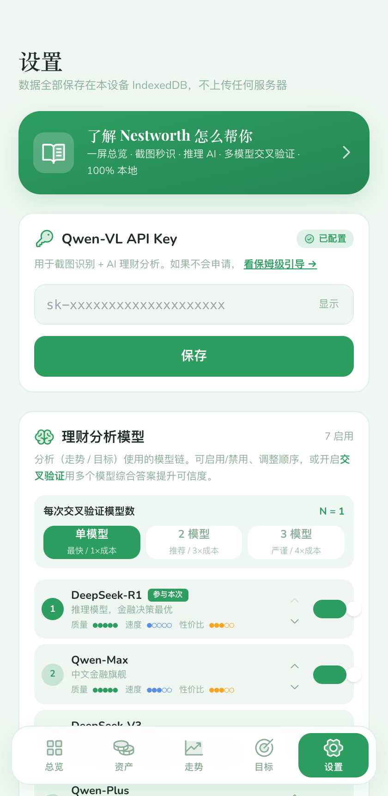
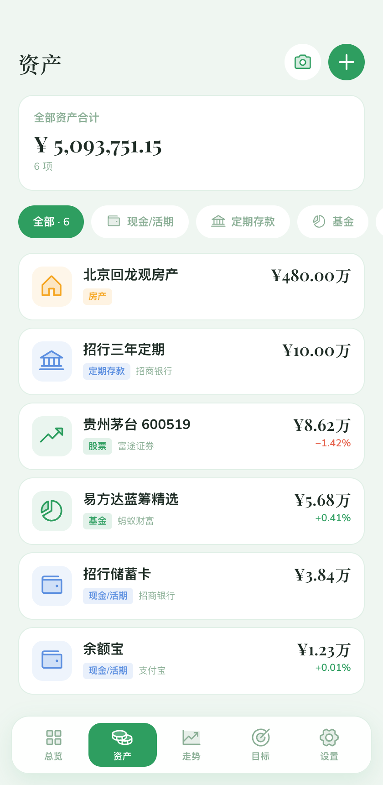
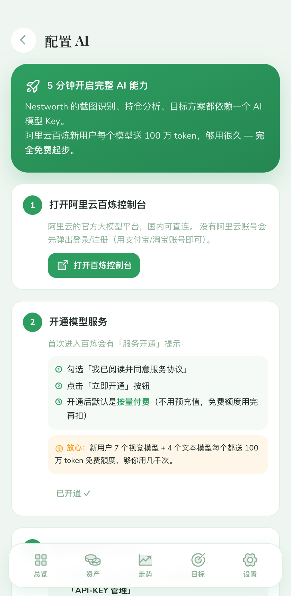

# Nestworth · 净值

[](https://github.com/weilan-shanshan/nest-worth/actions/workflows/build.yml)
[](LICENSE)
[](https://web.dev/progressive-web-apps/)

> **一切关乎"你值多少"的事，现在只在一个画面里完成。**
>
> 不必登录 · 不必交账户密码 · 不必再开 8 个 App
> 本地存储 · 推理 AI · 多模型交叉验证 · 实时市场锚点

把分散在各 App（银行 / 支付宝 / 券商 / 基金 / 加密钱包 / 房产 …）的资产汇成一处可视画面的 PWA。**个人资产数据 100% 本地，绝不上传 · 零账号 · 仅统计基础访问数据（可关）**。

<p align="center">
  
  
  
</p>

<p align="center">
  <em>左：总览页 · 中：走势 + AI 持仓分析 · 右：目标 + AI 整体增值方案</em>
</p>

---

## 为什么是 Nestworth

### 📊 一屏总览 — 关掉那 8 个 App
**以前**：算月底净值要轮流打开支付宝 / 招行 / 富途 / 蚂蚁财富 / 加密钱包 / 房产估价工具 …
**现在**：在 Nestworth 一屏看完：总净值、月增、年增 (YTD)、距目标进度，加上 9 大类资产的占比可视化。

### 📸 截图入账 — 别再手抄余额
**以前**：账单截了一堆，得对着图一笔笔输入 App，输错还得返工。
**现在**：上传一张支付宝/银行/券商截图 → AI 1 秒识别金额、平台、类型、涨跌幅 → 一键勾选导入。
**7 个免费视觉模型自动 fallback**（Qwen-VL Plus / Max · Qwen2.5-VL 7B/32B/72B · QVQ-Max · QVQ 72B），免费额度可识别 **3500+ 张**。

### 🧠 推理 AI — 不是模板顾问，是会思考的顾问
**市面上的 AI 理财大多是"通用模板配置 6:3:1"。**
Nestworth 用 **DeepSeek-R1** 推理模型 + 实时市场数据：
- **走势页** — 诊断每一项资产 → 给出止盈/止损/调仓的具体动作
- **目标页** — 基于实际缺口算出整体增值方案 → 现有持仓优化 + 中国/全球新增配置 + 分阶段时间表

### 🔀 多模型交叉验证 — 让 N 个模型先开个会
单模型回答总有"幻觉风险"。设置里打开 **N=2 或 N=3** 模式：
DeepSeek-R1 + Qwen-Max + DeepSeek-V3 多个顶级模型并行回答，再让最强者综合 — 去掉离群、保留共识。
**相当于找了一组独立顾问开会，给你一个稳的方案。**

<p align="center">
  
  
</p>

<p align="center">
  <em>左：模型链可启用/禁用、调整顺序、切换 N=1/2/3 交叉验证 · 右：资产明细页</em>
</p>

### 📡 实时市场锚点 — AI 给的"年化 5-8%"不是瞎编
某些 AI 顾问的年化预期是从训练数据里"拍脑袋"出来的。
Nestworth 实时拉 **USD/CNY/HKD 汇率、黄金价格**，把这些"市场锚点"喂给模型再分析。
**每张建议卡底部明示：基于哪些数据、几点几分抓取、哪个模型生成。**

### 🔒 本地优先 — 你的资产数据，永远不离开你的设备
记账类 SaaS 都要你注册账号、把账户密码、所有持仓上传到他们服务器。
Nestworth **没有账号、个人资产数据 100% 本地，绝不上传服务器**（金额、资产名、API Key、ticker 全部留在你浏览器）。所有资产数据存在你浏览器的 IndexedDB 里，跟你的 Cookie 一样属于你自己。
截图只在识别那 1 秒上传给阿里云 OCR，处理完即弃。

> 透明说明：为了知道有多少人在用、哪个功能要保留或改进，网站会统计**基础访问数据**——有多少人来用、点了哪些按钮、停留多久。不含任何资产、金额、Key 或账户信息，IP 也不入库；「设置 → 网站访问统计」一键关闭。代码在 [`src/lib/analytics.ts`](src/lib/analytics.ts)、后端在 [`server/`](server/)，自己 host 跑得起来。

### 📱 完整 PWA — 装到主屏、离线可读、跟原生 App 一样
- **iOS Safari**：分享 → 添加到主屏幕 → 全屏体验，App 内会自动引导
- **Android Chrome**：自动弹出"添加 Nestworth"安装按钮
- **离线缓存**：字体、汇率、加密行情都被 service worker 缓存，飞机上也能查净值
- **LLM 调用 NetworkOnly**：分析必须实时，不用过期数据骗你

---

## 5 步开始用

> 第一次进 app，**未配置 API Key 时全 app 都会引导你去走配置流程**（不是干巴巴的报错），并且申请 Key 这种专业操作有保姆级 4 步引导：

<p align="center">
  
</p>

1. **申请一个免费 API Key** — 去 [阿里云百炼控制台](https://bailian.console.aliyun.com/) 注册（5 分钟）。7 个视觉模型每个送 100 万 token，约够识别 3500 张截图。
2. **把 Key 粘贴到「设置 → Qwen-VL API Key」** — 或直接走 `/setup-key` 引导页，会**真实调用一次 qwen-turbo 验证**你的 Key 是否有效。Key 加密存在你浏览器，离开浏览器就消失。
3. **把分散的资产汇集进来** — 总览页两个大按钮：「截图识别」适合从 App 截图批量入账，「手动添加」适合定存、房产这类不变动的资产。
4. **设个目标，听 AI 给方案** — 在「目标」页加一个目标（比如"年底总净值 600 万"），AI 立刻给出整体增值方案：现有优化 + 新增配置 + 时间表。
5. **隔几天导出一次备份** — 「设置 → 导出备份」生成 JSON 文件 → 存到 iCloud Drive / 网盘 / 邮箱。换设备直接导回。

---

## 这个工具适合谁

✅ 同时管理 5 个以上金融账户、想集中查看的人
✅ 关心隐私、不愿把账户密码或资产明细交给陌生 SaaS 的人
✅ 愿意每月花 5 分钟更新数据、想要一个 AI 提醒哪里能优化的人
✅ 前端开发者 / 喜欢"自己能修"的工具的人（开源）

❌ 想要专业级量化分析或税务规划（请找认证理财师）
❌ 想要直接下单买卖（这是只读看板，不是交易工具）

---

## 我们对你的承诺

> *不是隐私政策模板，是我们能力范围内做到的事 —— 业务数据从一开始就不传给我们，所以我们就算想"出卖"你也做不到。*

| 承诺 | 怎么做到的 |
|---|---|
| **资产数据 100% 在你设备** | 全部存在浏览器 IndexedDB，永远不上传服务器 |
| **截图识别完即弃** | 截图只在识别瞬间传给阿里云 OCR，结果回到你设备后原图就消失 |
| **API Key 在你浏览器** | 不用注册账号，Key 跟你的 Cookie 一样属于你 |
| **AI 调用都标注来源** | 每张建议卡底部明示用了哪个模型、抓了哪些实时数据、何时生成 |
| **只统计基础访问数据** | 只看有多少人来用、点了哪些按钮、停留多久，**绝不含资产 / 金额 / Key / ticker**；IP 不入库；设置里可关 |

---

## 本地开发

```bash
# 1. 安装依赖（macOS / Node 18 推荐加 --ignore-scripts 跳过 esbuild postinstall 自检）
npm install --ignore-scripts

# 2. 配置 API Key（可选，也可以在设置页填）
cp .env.example .env.local
# 填入 VITE_DASHSCOPE_API_KEY=sk-xxx

# 3. 启动开发服务器
npm run dev
# → http://localhost:5173
```

> **Node 版本：必须 Node 20+**（PWA 工具链依赖 Node 20 的 `diagnostics_channel.tracingChannel`）。仓库根 `.nvmrc` 已锁定，推荐用 nvm：
> ```bash
> nvm use   # 自动读 .nvmrc 切到 20
> ```
> Cloudflare Pages 通过 `NODE_VERSION=20` 环境变量解决。

---

## 部署到 Cloudflare Pages（推荐：免备案 · 免费 · 国内可访问）

1. `npm run build` 本地验证可以构建
2. 推到 GitHub
3. Cloudflare Pages → Create Project → Connect to GitHub
4. 构建配置：
   - **Build command**: `npm install --ignore-scripts && npm run build`
   - **Build output**: `dist`
   - **Environment variables**: `NODE_VERSION=20`
5. 绑定自定义域名（可选）
6. 完成 — 全球 CDN、国内可访问、零成本

---

## 技术栈

| 类别 | 技术 |
|---|---|
| **前端** | Vue 3 + TypeScript + Vite 5 |
| **样式** | UnoCSS（含 Iconify Phosphor 图标） |
| **状态** | Pinia |
| **存储** | Dexie.js（IndexedDB） |
| **图表** | ECharts 5 |
| **AI 截图识别** | 阿里云百炼 — Qwen-VL Plus / Max · Qwen2.5-VL 7B/32B/72B · QVQ-Max · QVQ 72B Preview |
| **AI 理财分析** | 阿里云百炼 — DeepSeek-R1（推理）· Qwen-Max · DeepSeek-V3 · Qwen-Plus · Qwen2.5-72B/32B · Qwen-Turbo |
| **市场数据** | CoinGecko（加密 + PAXG 黄金）· open.er-api.com（汇率主源）· Frankfurter（ECB 备源） |
| **部署** | Cloudflare Pages — 纯静态前端，资产数据全在本地 |

---

## 项目结构

```
src/
├── views/                  # 5 个页面 + 关于页
│   ├── Home.vue           # 总览（净值卡 + 月增长图 + 资产分组聚合）
│   ├── Assets.vue         # 资产明细 + CRUD
│   ├── Trend.vue          # 走势图 + AI 持仓分析
│   ├── Goals.vue          # 目标 + AI 整体增值方案
│   ├── Settings.vue       # API Key + 模型链 + 备份
│   └── About.vue          # 关于 / 使用说明
├── components/            # 可复用 UI
│   ├── AppShell.vue       # 外框 + 底部导航
│   ├── AssetGroupCard.vue # 资产分组聚合卡（可展开）
│   ├── AdviceCard.vue     # AI 建议通用容器
│   ├── AdviceMetaFooter.vue   # 模型 + 实时锚点 footer
│   ├── ScreenshotImporter.vue # 截图识别 modal
│   └── AssetEditor.vue    # 资产编辑 modal
├── lib/
│   ├── recognize.ts       # 截图识别 + 视觉模型链
│   ├── advisor.ts         # 理财分析 + 交叉验证
│   ├── market-data.ts     # 实时市场数据（多源 fallback）
│   ├── asset-meta.ts      # 9 大资产类型元信息
│   └── format.ts          # 金额/百分比/日期格式化
├── store/
│   └── assets.ts          # Pinia 全局 store
├── db.ts                  # Dexie schema (v2)
├── types.ts               # TypeScript 类型
└── router.ts              # vue-router 路由表
```

---

## 数据备份

- **导出**：设置 → 导出备份 → 下载 JSON 文件
- **存放建议**：iCloud Drive / 阿里云盘 / 邮箱给自己
- **跨设备恢复**：设置 → 导入备份 → 选 JSON 文件
- **清缓存前必备份**：浏览器清缓存会清掉 IndexedDB

---

## 自动行情同步（基金 / 股票）

给资产配「行情代码」后，系统每天自动拉最新价 × 持仓数 = 余额，**无需手动维护**。

| 资产类型 | 数据源 | 是否需要 CF Worker |
|---|---|---|
| A 股 / 港股 / 美股 | 腾讯股票 | ✅ 需要 |
| 国内基金 | 天天基金 | ✅ 需要 |

### 部署 CF Worker（5 分钟，免费）

```bash
# 1. 登 https://dash.cloudflare.com → Workers & Pages → Create → Worker
# 2. 把 worker/quotes-proxy.js 整个粘进编辑器 → Deploy
# 3. 拿到 Worker URL（如 https://nestworth-quotes.you.workers.dev）
# 4. CF Pages 项目 → Settings → Environment variables 加：
#    VITE_QUOTE_PROXY = <Worker URL>
# 5. Pages → Deployments → Retry deployment 触发 redeploy
```

之后给资产编辑面板里填行情代码（如 `600519` / `AAPL` / `008888`）+ 持仓数量，App 启动时自动拉新价。

## 路线图
- [ ] **个人画像** — 设置页加年龄、收入、风险偏好，让 AI 推荐更贴合
- [ ] **多目标对比** — 同时跟多个目标进度，AI 协调资源分配
- [ ] **可选云同步** — 端到端加密的 Cloudflare D1 同步（默认关闭）
---

## 截图重新生成

```bash
# 1. 启动 dev server
npm run dev

# 2. 另一个终端
npm install --no-save puppeteer-core
node scripts/screenshots.mjs
# → 输出到 docs/screenshots/*.png
```

脚本用系统 Chrome (`/Applications/Google Chrome.app/...`) headless 模式，无需额外下载浏览器。

---

## 安全说明

- API Key 存在浏览器 IndexedDB（用户设备本地），不上传任何服务器
- 当前 MVP 版本前端直接调阿里云百炼 API；如要公开发布，请走 Cloudflare Workers 代理把 key 留服务端
- 资产数据全本地，永不上传任何服务器
- 截图识别会把图片传给阿里云 OCR（百炼有明确条款不使用 API 数据训练模型）

---

## 致谢

灵感来自所有"想要一个能集中看清自己资产的工具，但又不愿意把账户密码交给陌生 SaaS"的人。

---

**Nestworth · 净值**
*为想认真看清自己资产的人而做*
